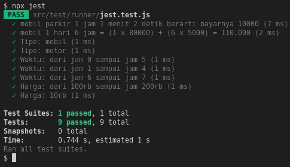

Unit Aplikasi Parkir dan Testingnya
==

- Setelah pertama kali melakukan Git Clone, jalankan `npm install`
- Untuk menjalankan Unit Testing, jalankan `npx jest`
- Source mengenai bagaimana Jest menjalankan test dapat di lihat di [./src/test/runner/jest.test.js](./src/test/runner/jest.test.js)

